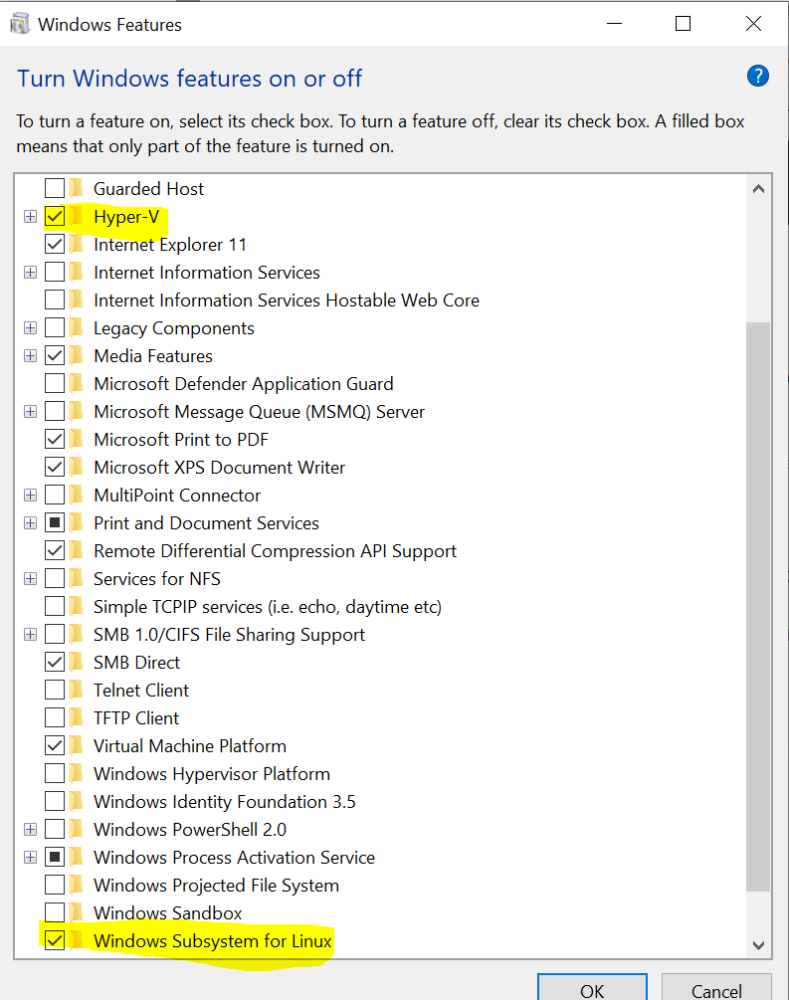
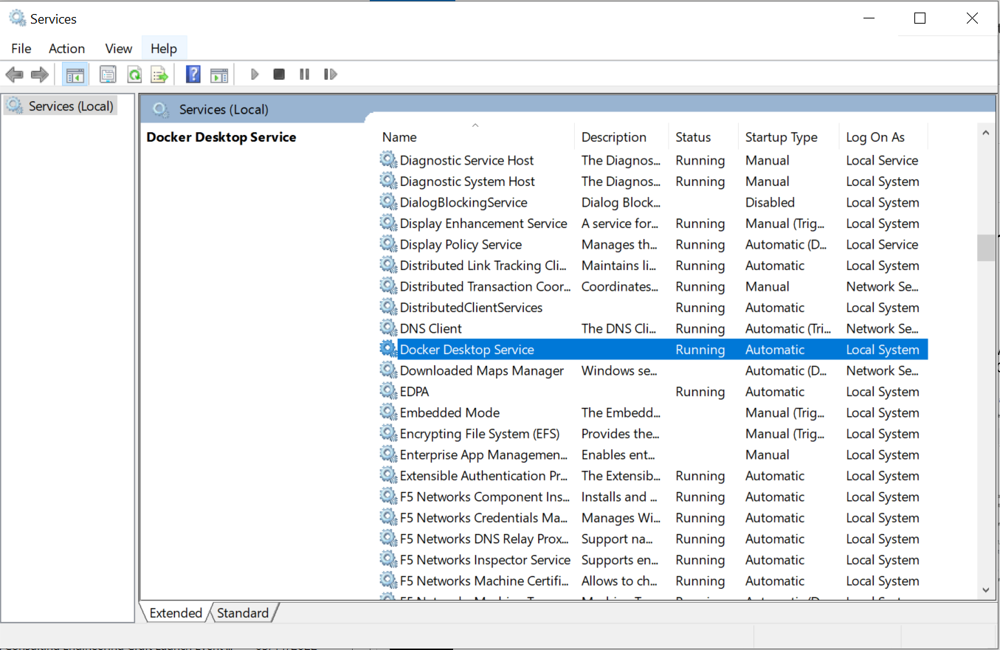

# Docker 101 - Docker Desktop installation for Windows

Docker Desktop provides the tools to run Docker on your Windows machine.

## Installation

1) Ensure that you are on the Deloitte network or connected to the Deloitte VPN and open the link for [Access to Deloitte - Software Catalog](https://software.uk.deloitte.com/)
2) Add the most recent Docker Community Edition for Windows Platform to cart and request the ticket.
3) Request Power Access in order to do this, you can request Power Access via a [quick form through the IT ServiceDesk on ServiceNow](https://deloitteemea.service-now.com/escgb?id=escgb_sc_cat_item&sys_id=8dc8cc2c1b0cf410b499b246464bcbfd).
4) Go to Start Menu and search for “Turn Windows features on or off” and make sure the following options are marked checked:
    - Hyper-V
    - Windows Subsystem for Linux
    
5) Watch out for the email and install the Docker Desktop installation file from the network path shared in the email.
6) Restart your laptop.
7) Ensure Docker service is running on the system ( Services.msc -> Docker ). Check the below image. In case it is not running, you may need to open Docker Desktop from Start Menu and sign in with a free Docker Hub account.
    

## Running

Now you have Docker desktop up and running, let’s explore.

First of all, let’s open a shell - use Git Bash, PowerShell or Command Prompt to check if docker CLI is usable:

	docker --version

This shows you the Docker client  version.

Let’s check if there are any containers running:

	docker ps

If you are following along while connected to the office or the VPN, you need to disconnect the internal network and perform the rest of the commands in the workshop with your home network or hotspot.
Run the following next:

	docker run -d -p 80:80 docker/getting-started
